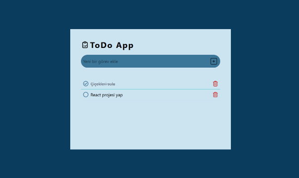

# ToDo App

React ve Tailwind CSS kullanılarak geliştirilmiş basit ve şık bir yapılacaklar listesi uygulamasıdır.

## Ekran Görüntüsü



## Özellikler

- Yeni görev ekleme
- Görev tamamlama
- Görev silme
- Tamamlanan görevleri çizili gösterme
- Temiz ve responsive arayüz

## Kullanılan Teknolojiler

- React
- Tailwind CSS
- Vite

## Kurulum

```bash
npm install